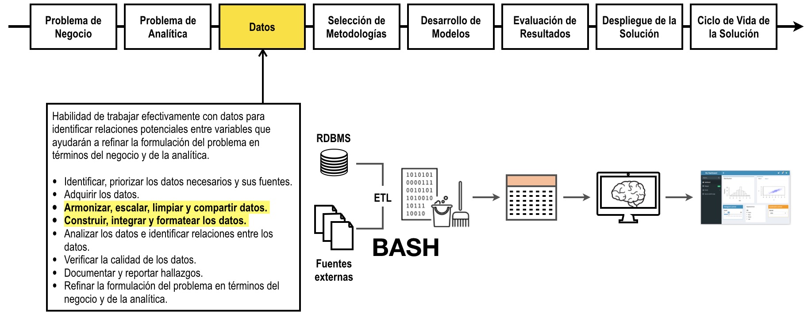

# Programación en Bash para extracción, transformación y carga de datos

Haga click [aquí](http://nbviewer.jupyter.org/github/jdvelasq/bash-for-analytics/tree/master/)
para visualizar este repositorio en nbviewer.

## Descripción

La interfaz de línea de comandos es una poderosa herramienta para el procesamiento
de archivos planos. Su capacidad para esta labor se deriva en el hecho de que
sus comandos están inherentemente desarrollados para procesar una línea de texto
a la vez, de tal forma que se pueden procesar archivos de gran tamaño sin mayores
problemas. En este tutorial se aborda el manejo de la interfaz de línea de comandos 
que se encuentra disponible en los sistemas operativos Windows, Linux y MacOS para 
la extracción, transformación y preparación para la carga de datos de archivos planos 
de texto.

El siguiente grafo muestra donde encaja este tutorial en el proceso.

## Objetivos

Al finalizar este tutorial el lector debe estar en capacidad de usar
la interfaz de línea de comandos para:

* Gestionar archivos y directorios.
* Realizar consultas sobre el contenido de los archivos.
* Aplicar filtros y criterios de selección sobre el contenido de un archivo.  
* Insertar, borrar y modificar información dentro de los archivos.
* Desarrollar programas en Bash.

## Requerimientos

Para realizar este tutorial usted debe cumplir con uno de los siguientes
requisitos:

* Usar Ubuntu como sistema operativo.
* Usar mac OS como sistema operativo.
* Usar Microsoft Windows 10 y tener instalado el prompt de comandos de Ubuntu.
* Usar Microssoft Windows y tener instalado [Cygwin](http://www.cygwin.com)

---

**Juan David Velásquez Henao**    
jdvelasq@unal.edu.co  
Universidad Nacional de Colombia, Sede Medellín  
Facultad de Minas  
Medellín, Colombia  
[LinkedIn](https://co.linkedin.com/in/juan-david-velásquez-henao-94078979), [GitHub](https://github.com/jdvelasq), [ResearchGate](https://www.researchgate.net/profile/Juan_Velasquez8)

[Licencia](https://github.com/jdvelasq/bash-for-analytics/tree/master/LICENSE)
